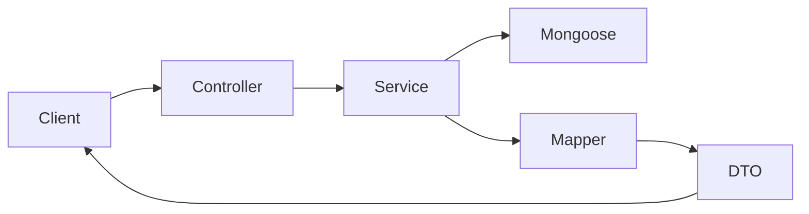

# Project Architecture

High-level system design for the NestJS + Angular monorepo. For feature inventories, see [features-backend.md](./features-backend.md) and [features-frontend.md](./features-frontend.md). For reusable building blocks, see [shared-infrastructure.md](./shared-infrastructure.md).

## Stack Overview

| Layer | Technology |
|-------|------------|
| Backend | NestJS, MongoDB (Mongoose), `@nestjs/schedule` |
| Frontend | Angular 21, Tailwind CSS 4, Angular Material (admin-ui) |
| Shared types | `@app/contracts` library (`backend/libs/contracts`) |
| Auth | JWT + refresh tokens, Passport strategies, role guards |

**Dev ports:** Backend `8200`, Admin UI `5100`, User UI `5200`. All API routes use URI versioning under `/v1/`.

## Monorepo Layout

```
nest-angular-starter/
├── backend/
│   ├── src/              # NestJS feature modules (auth, users, tasks, …)
│   ├── libs/contracts/   # Shared DTOs, commands, queries, enums
│   └── config/           # Typed env config (development / stage / production)
├── frontend/
│   └── projects/
│       ├── admin-ui/     # Admin dashboard (Material UI)
│       ├── user-ui/      # Public-facing app (minimal starter)
│       └── common-ui/    # Shared services, base classes, auth, pipes
├── docs/                 # Architecture and feature catalog (this folder)
└── AGENTS.md             # Agent workflow entry point
```

## Backend Architecture

### Request Flow



1. HTTP request hits a controller (guards, validation via `class-validator`).
2. Controller delegates to a service extending `BaseService`.
3. Service reads/writes MongoDB via Mongoose; list endpoints use `mongoose-paginate-v2`.
4. Mapper converts model documents to contract DTOs.
5. Controller returns DTOs — never raw Mongoose documents.

### Bootstrap (`backend/src/main.ts`)

- URI versioning: all routes prefixed `/v1/`
- Global `ValidationPipe` (whitelist unknown properties, `transform: true` for query coercion)
- Global `ThrottlerGuard` (20 requests / 10 seconds)
- Node cluster mode in production; worker `0` runs scheduled tasks
- Static file serving for uploads at `/v1/uploads`

### Module Organization

Features live directly under `backend/src/<feature>/` (not `src/modules/`). Each entity module typically contains:

```
src/<feature>/
  <feature>.module.ts
  model/          # Mongoose schemas extending BaseEntity
  services/       # Business logic; extends BaseService
  controllers/    # HTTP layer only
  mappers/        # Model → contract DTO
```

Reference implementation: `backend/src/users/`.

### Registered Modules (`AppModule`)

Auth, Users, Me, Dashboard, Notifications, Tasks, Utils, System — plus global Config, Mongoose, Throttler, and static uploads.

### Background Jobs

**There is no Redis, Bull, or separate job queue.** Background work uses:

- `@nestjs/schedule` + `SchedulerRegistry`
- MongoDB-backed `Task` documents managed by `TasksModule`
- `TasksRuntimeService` polls every 5 seconds; gated by `app.enableTasks` and `WORKER_NUMBER=0`

To add new background work, extend `TaskTypeEnum` and register an implementation — do not create a parallel scheduling system. See [shared-infrastructure.md](./shared-infrastructure.md).

### Configuration

Deployment-time config in `backend/config/{development,stage,production}.ts`, loaded via `registerAs` and accessed through NestJS `ConfigService`. Values that change at runtime belong in MongoDB (e.g. `SystemModule`), not config files.

## Contracts Library

Import alias: `@app/contracts` (configured in both backend and frontend `tsconfig.json`).

```
backend/libs/contracts/src/
├── dto/          # Response shapes (UserDto, PagedListDto, …)
├── queries/      # List/filter payloads (extend ShapeableQuery)
├── commands/     # Write payloads (CreateXCommand, UpdateXCommand)
├── enums/        # Shared enums (UserRole, TaskType, …)
└── codes/        # ErrorCode constants
```

**Contract-first workflow:** Add or change types in contracts first, then update backend implementation, then frontend usage. Never duplicate enums or DTO shapes in frontend apps.

## Frontend Architecture

### Three Angular Projects

| Project | Purpose | Import pattern |
|---------|---------|----------------|
| `admin-ui` | Role-gated admin CRUD, dashboard, system tools | Lazy-loaded feature routes under `LayoutComponent` |
| `user-ui` | Public-facing app shell | Minimal; no API integration yet |
| `common-ui` | Shared layer (not a separate ng-packagr library) | Relative imports, e.g. `../../../common-ui/services/users.service` |

### HTTP Flow

```
Component → common-ui/*Service (extends BaseApiService)
         → HttpClient
         → ${EnvironmentService.apiUrl}/<resource>   (e.g. http://localhost:8200/v1/users)
         → authInterceptor (Bearer token, auto-refresh on 401)
         → NestJS REST API
```

### Environment

Both apps read runtime config from `window.__env` (injected via `env.js` at build time). Key field: `apiUrl` pointing to backend `/v1` prefix.

### Admin UI Routing Pattern

Top-level routes in `app.routes.ts` wrap authenticated features in `LayoutComponent` with `isLoggedIn` + `hasRole` guards. Each feature has its own `*.routes.ts` lazy-loaded via `loadChildren`.

## Cross-Cutting Concerns

| Concern | Backend | Frontend |
|---------|---------|----------|
| Auth | JWT + refresh, `JwtGuard`, `RolesGuard`, `@Roles()` | `AuthSignal` (localStorage), `authInterceptor`, `isLoggedIn`, `hasRole` guards |
| Pagination | `ShapeableQuery` + `PagedListDto` | `BaseListComponent` + `queryToParams()` |
| Errors | Custom exceptions (`AppBadRequestException`, …) | `BaseComponent.extractErrorMessage()` |
| Resilience | `CircuitBreakersService`, `MutexService` | `CircuitBreakersService` (admin UI) |

### Security notes (starter defaults)

- **Uploads** are served publicly at `/v1/uploads` via `ServeStaticModule`. Restrict or proxy avatar access in production if files are sensitive.
- **JWT tokens** persist in browser `localStorage` (`AuthSignal`). Consider httpOnly cookies for stricter XSS posture.
- **Production CORS** defaults to an empty `corsOrigins` list in `production.ts` — set your deployed frontend URLs before going live.
- **Background tasks** require `app.enableTasks: true` (set in all env config files) and worker `0` in cluster mode.

## Implementation Rules (How to Build)

These Cursor rules cover *how* to implement; the docs in this folder cover *what already exists*:

| Rule | Path |
|------|------|
| Monorepo patterns | `.cursor/rules/monorepo-tech-patterns.mdc` |
| NestJS coding | `.cursor/rules/nestjs.mdc` |
| Entity module layout | `.cursor/rules/backend/module-entity-encapsulation.mdc` |
| Database / paging | `.cursor/rules/backend/database-model.mdc` |
| Config lifecycle | `.cursor/rules/backend/configuration-lifecycle.mdc` |
| Admin CRUD template | `.cursor/rules/frontend/admin-ui-entity-features.mdc` |
| Angular standards | `.cursor/rules/angular-20.mdc` |
| Feature catalog workflow | `.cursor/rules/project-catalog.mdc` |

## Last updated

2026-06-15
